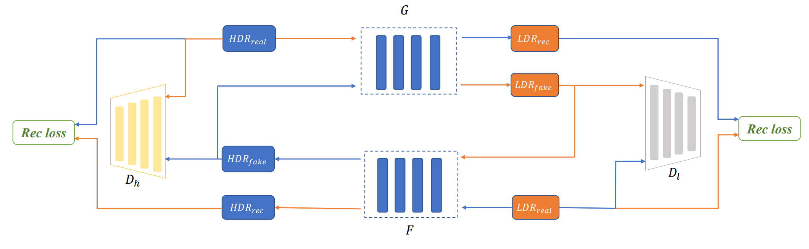

# LTM-GAN: A LIGHT-WEIGHT GENERATIVE ADVERSARIAL NET FOR TONE MAPPING
 
By [Di Li](https://scholar.google.com/citations?user=r6WfS2gAAAAJ), and [Susanto Rahardja](https://scholar.google.com/citations?user=OdkA4jMAAAAJ&hl=en) 

## Introduction

The codebase provides the official PyTorch implementation for the paper ["LTM-GAN: A LIGHT-WEIGHT GENERATIVE ADVERSARIAL NET FOR TONE MAPPING"](https://ieeexplore.ieee.org/abstract/document/10405969) (accepted by 2023 IEEE 66th International Midwest Symposium on Circuits and Systems (MWSCAS)).

<p align="center">
  
</p>

In this project, we propose a light-weight generative adversarial net structure to automatically learn the tone mapping function without supervision. Aside from the main tone mapping transformation, we also construct an auxiliary model aiming at learning the inverse tone mapping so as to enforce the consistency of the transformation between HDR images and LDR images.
Perceptual loss is also introduced to improve the naturalness of the tone mapped images. Experimental results show that our algorithms achieve outstanding performance in both visual naturalness and structure fidelity.


## Dependencies 

- Python 3 (Recommend to use [Anaconda](https://www.anaconda.com/download/#linux))
- [PyTorch >= 1.0](https://pytorch.org/)
- Opencv
- Imageio
- [visdom](https://github.com/facebookresearch/visdom)

## Datasets

an HDR dataset that consists of 75 HDR images was collected from various sources, including Reinhard’s dataset, ETHyma dataset and other opensource websites [1](http://markfairchild.org/HDRPS/HDRthumbs.html).

The final directory structure is as follows.

```
./HDR_img
    trainA/         # HDR train inputs
    trainB/         # 8-bit sRGB train groundtruth
    testA/          # HDR test inputs
    testB/          # 8-bit sRGB test groundtruth
```
## Train
- run visdom to monitor status
```
visdom
```
- run
```bash
python train.py --data_norm log_norm --batch_size 2 --d_iter 5 --lambda_A 5 --lambda_B 5 --lambda_gp 10 --loss wasserstein --name LTMGAN --norm_d batch --spectral_norm --no_scale
```

## Test
- run
```bash
python test.py --dataroot ./HDR_img/testA --name LTMGAN --netG convnet --model_suffix _A --spectral_norm
```

## Citation
If you find this repository useful, please kindly consider citing the following paper:

```BibTeX
@inproceedings{li2023ltm,
  title={LTM-GAN: A Light-Weight Generative Adversarial Net for Tone Mapping},
  author={Li, Di and Rahardja, Susanto},
  booktitle={2023 IEEE 66th International Midwest Symposium on Circuits and Systems (MWSCAS)},
  pages={962--966},
  year={2023},
  organization={IEEE}
}
```

## License

Our project is licensed under a [MIT License](LICENSE).